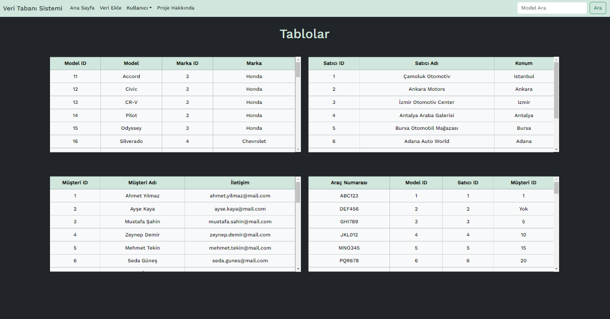
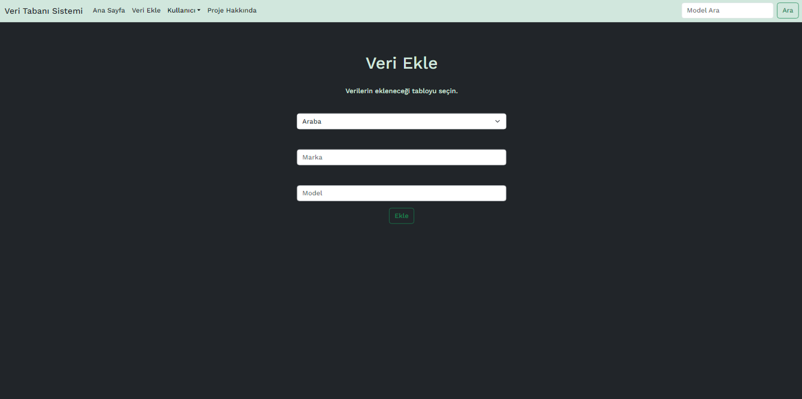
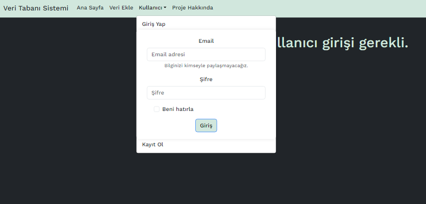

# BLM5225-Project

## Overview
This project is part of the MSC - Database Modeling and Design course for the 2023/2024 term. It's a comprehensive system that allows users to interact with a database through a web interface.

## Screenshots

## Getting Started

### Prerequisites
- Node.js
- npm (Node Package Manager)

### How to Start
To get the application up and running, follow these steps:

1. **Start the Backend Server:**
   Navigate to the `api` directory and run the `app.js` file.
    - `cd api`
    - `node app.js`

2. **Start the Frontend Application:**
In a new terminal, go to the `frontend` directory and start the React application.
    - `cd frontend`
    - `npm start`

## Features
- **User Authentication:** Register and log in to the system.
- **Data Review:** Browse various tables created in the database.
- **Data Manipulation:** Add new data to existing tables.
- **Search Functionality:** Perform search operations within the tables.

## Technologies Used
### **Frontend:**
- React 18
- React Bootstrap
- Google Font API
### **Backend:**
- Node.js
- Express.js
### **Database:**
- SQLite

## Contributing
Contributions to this project are welcome. Please fork the repository and submit a pull request with your proposed changes.